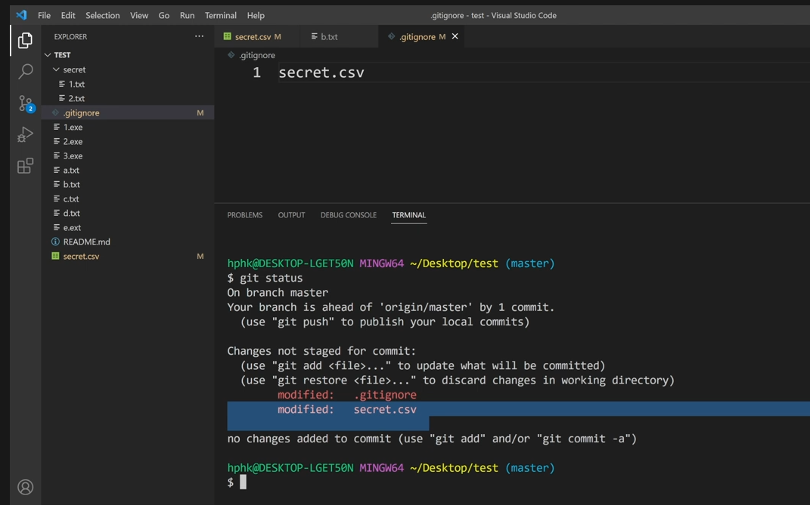

# 로컬 저장소 만들기

## 1. 프로젝트 폴더 생성

* 0706 폴더 생성하기


## 2. 해당 폴더에서 Git 버전 관리 시작하기

```bash
$ git init
```

* master 라고 되어있으면 상위 폴더를 확인하자

* 명령어를 입력하면 ``.git`` 폴더가 생성된다

  

## 3. 작업

* 별도의 빈 파일 하나 생성
* git status도 확인하기


## 4. 작업이 완료되면 커밋하기

* 커밋하고 git log도 확인하기


# 원격 저장소에 업로드하기

## 1. 원격 저장소에 연결

```bash
$ git remote add origin https://github.com/Bonbon315/TIL
```


## 2. 원격 저장소에 연결됐는지 확인

```bash
$ git remote -v
```


## 3. 맨 처음 원격 저장소에 올리는 경우

```bash
$ git push -u origin master
```


## 4. Git Push

```bash
$ git push
$ git push origin master
```


## 5. Git pull

```bash
$ git pull
$ git pull origin master
```


# 기타 노트

* 작업전에 pull, 작업종료후 push 생활화
* .gitignore 에 미리 파일명을 넣어두면 커밋을 안하고 무시할 수 있다



* gitignore 검색하면 다른사람이 만들어둔 프리셋을 쓸 수 있다.
* Github의 README.MD를 잘 관리해보자