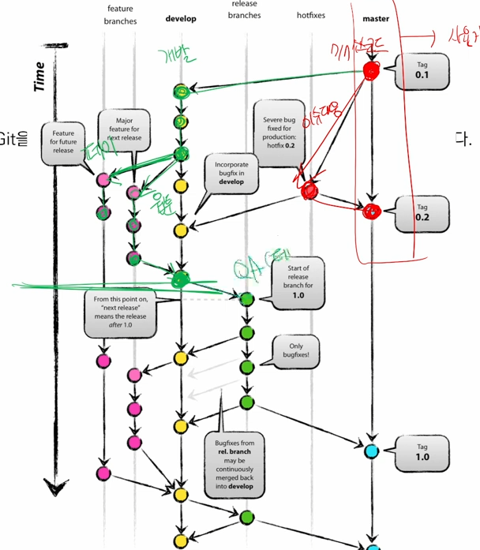

# Clone

```bash
$ git clone https://github.com/kdt-live/TIL.git
```

* 상위폴더에 git init이 안된 경로에서 clone하도록 하자.
* 이후 업데이트가 있을시 다음 명령어로 가져오자.

```bash
$ git pull origin master
```


## 전체적인 흐름 

```bash
# 로컬
$ git init
$ git add .
$ git commit -m '메시지'
$ git status
$ git log

#원격
$ git push origin master
$ git pull origin master
$ git remote add origin [link]
$ git clone [link]
```


# 협업



* 개별적으로 나눠진 각 branch에서 작업을 진행하고, merge해서 master branch에 업데이트를 하는 형식으로 분업이 진행된다.


## 형태

1. Feature Branch Workflow

   * Shared repository model (저장소의 소유권이 있는 경우)

2. Forking Workflow

   * Fork & Pull model (저장소의 소유권이 없는 경우)

   

## Branch 명명

| Branch                        | 주요 특징                                                    |
| :---------------------------- | ------------------------------------------------------------ |
| master (main)                 | 배포 가능한 상태의 코드                                      |
| develop (main)                | feature branch로 나뉘어지거나, 발생된 버그 수정 등 개발 진행<br />개발 이후 release branch로 갈라짐 |
| feature branches (supporting) | 기능별 개발 브랜치(topic branch)<br />기능이 반영되거나 드랍되는 경우 브랜치 삭제 |
| release branches (supporting) | 개발 완료 이후 QA/Test 등을 통해 얻어진 다음 배포 전 minor bug fix등 반영 |
| hotfixes (supporting)         | 긴급하게 반영 해야하는 bug fix<br />release branch는 다음 버전을 위한 것 이라면 hotfix branch는 현재 버전을 위한것 |


# Branch

```bash
#브랜치 생성
$ git branch [브랜치이름]

#브랜치 조회
$ git branch

#브랜치 이동
$ git checkout [브랜치명]
$ git checkout -b [브랜치명] # 브랜치 생성후 이동하기

#브랜치 삭제
$ git branch -d [브랜치명]

#브랜치 병합(merge)
$ git merge [브랜치명]
$ git merge [브랜치명] --edit #병합 후 바로 편집기가 나오면서 커밋 메시지 수정 가능
$ git merge [브랜치명] --no-edit #커밋 메시지 수정없이 바로 병합

```


## Branch 병합 시나리오

> branch 관련된 명령어는 간단하다.
>
> 다양한 시나리오 속에서 어떤 상황인지 파악하고 자유롭게 활용할 수 있어야 한다.

### 상황 1. fast-foward

> fast-foward는 feature 브랜치 생성된 이후 master 브랜치에 변경 사항이 없는 상황

1. feature/home branch 생성 및 이동

   ```bash
   (master) $ git branch feature/home
   (master) $ git checkout feature/home
   ```

2. 작업 완료 후 commit

   ```bash
   (feature/home) $ touch home.txt
   (feature/home) $ git add .
   (feature/home) $ git commit -m 'Add home.txt'
   (feature/home) $ git log --oneline
   b534a34 (HEAD -> feature/home) Complete Home!!!!
   e89616a (master) Init
   ```


3. master 이동

   ```bash
   (feature/home) $ git checkout master
   (master) $ git log --oneline
   ```
   
   


4. master에 병합

   ```bash
   (master) $ git merge feature/home 
   Updating e89616a..b534a34
   Fast-forward
    home.txt | 0
    1 file changed, 0 insertions(+), 0 deletions(-)
    create mode 100644 home.txt
   ```
   
   


5. 결과 : fast-foward

   ```bash
   (master) $ git log --oneline
   b534a34 (HEAD -> master, feature/home) Complete Home!!!!
   e89616a Init
   ```

   

6. branch 삭제

   ```bash
   (master) $ git branch -d feature/home 
   Deleted branch feature/home (was b534a34).
   ```
   
   

---

### 상황 2. merge commit

> 서로 다른 이력(commit)을 병합(merge)하는 과정에서 **다른 파일이 수정**되어 있는 상황
>
> git이 auto merging을 진행하고, **commit이 발생된다.**

1. feature/about branch 생성 및 이동

   ```bash
   (master) $ git checkout -b feature/about
   (feature/about) $
   ```

   

2. 작업 완료 후 commit

   ```bash
   (feature/about) $ touch about.txt
   (feature/about) $ git add .
   (feature/about) $ git commit -m 'Add about.txt'
   (feature/about) $ git log --oneline
   5e1f6de (HEAD -> feature/about) 자기소개 페이지 완료!
   b534a34 (master) Complete Home!!!!
   e89616a Init
   ```

   

3. master 이동

   ```bash
   (feature/about) $ git checkout master
   (master) $
   ```

4. *master에 추가 commit 이 발생시키기!!*

   * **다른 파일을 수정 혹은 생성하세요!**

   ```bash
   (master) $ touch master.txt
   (master) $ git add .
   (master) $ git commit -m 'Add master.txt'
   (master) $ git log --oneline
   98c5528 (HEAD -> master) 마스터 작업....
   b534a34 Complete Home!!!!
   e89616a Init
   ```

   

5. master에 병합

   ```bash
   (master) $ git merge feature/about
   ```

   

6. 결과 -> 자동으로 *merge commit 발생*

7. 커밋 및 그래프 확인하기

   ```bash
   $ git log --oneline --graph
   *   582902d (HEAD -> master) Merge branch 'feature/about'
   |\
   | * 5e1f6de (feature/about) 자기소개 페이지 완료!
   * | 98c5528 마스터 작업....
   |/
   * b534a34 Complete Home!!!!
   * e89616a Init
   ```

8. branch 삭제

   ```bash
   $ git branch -d feature/about 
   Deleted branch feature/about (was 5e1f6de).
   ```
   
   

---

### 상황 3. merge commit 충돌

> 서로 다른 이력(commit)을 병합(merge)하는 과정에서 **같은 파일의 동일한 부분이 수정**되어 있는 상황
>
> git이 auto merging을 하지 못하고, 충돌 메시지가 뜬다.
>
> 해당 파일의 위치에 표준형식에 따라 표시 해준다.
>
> 원하는 형태의 코드로 직접 수정을 하고 직접 commit을 발생 시켜야 한다.

1. feature/test branch 생성 및 이동

   ```bash
   (master) $ git checkout -b feature/test
   ```

   

2. 작업 완료 후 commit

   ```bash
   # README.md 파일 열어서 수정
   (feature/test) $ touch test.txt
   (feature/test) $ git add .
   (feature/test) $ git commit -m 'Add test.txt'
   (feature/test) $ git log --oneline
   95fad1c (HEAD -> feature/test) README 수정하고 test 작성하고
   582902d (master) Merge branch 'feature/about'
   98c5528 마스터 작업....
   5e1f6de 자기소개 페이지 완료!
   b534a34 Complete Home!!!!
   e89616a Init
   ```


3. master 이동

   ```bash
   $ git checkout master
   ```
   
   


4. *master에 추가 commit 이 발생시키기!!*

   * **동일 파일을 수정 혹은 생성하세요!**

   ```bash
   # README.md 파일 열어서 수정
   (master) $ git add README.md
   (master) $ git commit -m 'Update README.md'
   ```

   

5. master에 병합

   ```bash
   (master) $ git merge feature/test 
   Auto-merging README.md
   CONFLICT (content): Merge conflict in README.md
   Automatic merge failed; fix conflicts and then commit the result.
   ```
   
   


6. 결과 -> *merge conflict발생*

   > git status 명령어로 충돌 파일을 확인할 수 있음.

   ```bash
   (master|MERGING) $ git status
   On branch master
   You have unmerged paths.
     (fix conflicts and run "git commit")        
     (use "git merge --abort" to abort the merge)
   
   Changes to be committed:
           new file:   test-1.txt
           new file:   test-2.txt
           new file:   test.txt
   
   Unmerged paths:
     (use "git add <file>..." to mark resolution)
           both modified:   README.md
   ```
   
   


7. 충돌 확인 및 해결

   ```
   <<<<<<< HEAD
   # 마스터에서 작업함...
   =======
   # 테스트에서 작성
   >>>>>>> feature/test
   ```

   => 나보고 고치라는 것인가 학생^^?


8. merge commit 진행

   ```bash
   (master|MERGING) $ git add .
   (master|MERGING) $ git commit
   ```

   * vim 편집기 화면이 나타납니다.

     * 자동으로 작성된 커밋 메시지를 확인하고, `esc`를 누른 후 `:wq`를 입력하여 저장 및 종료를 합니다.
     * `w` : write
     * `q` : quit

   * vs code 편집기에서 메시지보고 닫아주세요~!

     

9. 커밋 및 확인하기

   ```bash
   (master) $ git log --oneline --graph
   *   bc1c0cd (HEAD -> master) Merge branch 'feature/test'
   |\  
   | * 95fad1c (feature/test) README 수정하고 test 작성하고
   * | 2ecad28 리드미 수정
   |/  
   *   582902d Merge branch 'feature/about'
   |\  
   | * 5e1f6de 자기소개 페이지 완료!
   * | 98c5528 마스터 작업....
   |/  
   * b534a34 Complete Home!!!!
   * e89616a Init
   ```


10. branch 삭제

    ```bash
    (master) $ git branch -d feature/test
    ```
    
    
